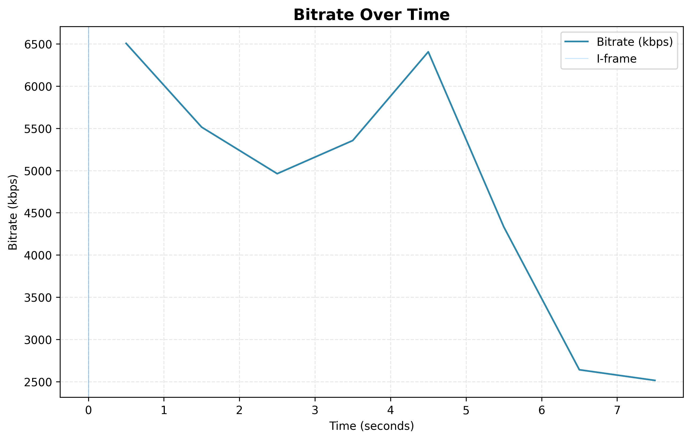

# L35 — Advanced Video Compression Analysis & Visualization Toolkit

*A professional-grade, FFmpeg-centric video analysis and manipulation toolkit that exposes the inner workings of H.264/AVC compression through metadata extraction, motion vector visualization, and controlled pixel-level editing of compressed video streams.*

---

## Abstract

Modern video codecs achieve remarkable compression ratios, but their internal decisions remain invisible to most people. This toolkit makes the "black box" transparent: it extracts the complete technical metadata of any H.264 video, renders the motion vectors and macroblock grid as a visual overlay, and demonstrates how adding new content (a bouncing, rotating rectangle) affects compression efficiency. Three tasks, one toolkit, and a deeper understanding of how video compression really works.

---

## Applications & Use Cases

**1. Streaming Quality Optimization**
A video engineer notices buffering on a live stream. Using Task 1, they analyse the GOP structure and discover a GOP of 250 — far too long for live streaming. Switching to GOP=30 reduces latency.

**2. Surveillance Motion Analysis**
A security engineer's motion detection produces false positives during scene changes. Task 2 reveals that I-frames have zero motion vectors while P-frames show massive spurious vectors at cuts.

**3. Content-Aware Compression Tuning**
A content creator adds a watermark and the file size doubles. Task 3 shows exactly why — the moving overlay forces the encoder to produce new motion vectors and larger residuals every frame.

**4. Educational Demonstration**
A professor runs all three tasks on a sample video to visually explain GOP structure, motion compensation, and rate-distortion trade-offs in a single lecture.

---

## Features

- Full video metadata extraction via FFprobe (container, video stream, audio stream, GOP)
- Per-frame statistics with I/P/B classification and CSV export
- Three publication-quality graphs: pie chart, box plot, bitrate timeline
- Motion vector overlay video with macroblock grid using FFmpeg `codecview`
- Automatic sample frame extraction (I/P/B, high-motion, low-motion)
- Semi-transparent rotating rectangle overlay (decompress -> edit -> recompress)
- Compression impact analysis with before/after metrics and bar chart
- Ring buffer logging system with configurable rotation
- Single entry point: run all tasks or select individually

---

## Video Compression Background

### What is a GOP (Group of Pictures)?

A GOP is a sequence of frames starting with an **I-frame** (complete image) followed by **P-frames** and **B-frames**. Think of it like a chapter in a book:

- **I-frame** = the full chapter — everything spelled out
- **P-frame** = "same as before, but change paragraph 3"
- **B-frame** = "blend paragraph 3 from the previous AND next chapter"

| Frame Type | Full Name | How It Works | Typical Size |
|---|---|---|---|
| **I-frame** | Intra-coded | Complete image, no dependencies | Large (60+ KB) |
| **P-frame** | Predicted | References previous frames only | Medium (~36 KB) |
| **B-frame** | Bi-directional | References both past and future | Small (~20 KB) |

### Motion Vectors — The Core of Temporal Compression

A motion vector tells the decoder: "This 16x16 block hasn't changed — it just moved 5 pixels right and 3 pixels down since the last frame." Instead of storing the block again, only the movement direction is stored.

| Color | Arrow Type | Frame Type | Meaning |
|---|---|---|---|
| Green | Forward MV | P-frame | Block came from a previous frame |
| Blue | Forward MV | B-frame | Block came from a previous frame |
| Red | Backward MV | B-frame | Block came from a future frame |
| Grid | Macroblock borders | All frames | 16x16 pixel block boundaries |

---

## Environment & Requirements

| Component | Requirement |
|---|---|
| **Python** | 3.10+ |
| **FFmpeg** | 7.0+ with libx264 and codecview |
| **OS** | Windows 11 (WSL or native), Linux, macOS |
| **Memory** | < 500 MB peak |

### Core Dependencies

| Package | Version | Purpose |
|---|---|---|
| numpy | 1.26.4 | Array operations, statistics |
| opencv-python | 4.10.0.84 | Frame reading/writing, rectangle drawing |
| matplotlib | 3.9.2 | Graph generation (pie, box, line, bar) |
| pandas | 2.2.3 | CSV generation and frame data handling |

---

## Virtual Environment Setup (REQUIRED)

### Step 1: Install UV (if not installed)

**Linux/Mac/WSL:**
```bash
curl -LsSf https://astral.sh/uv/install.sh | sh
```

**Windows PowerShell:**
```powershell
powershell -c "irm https://astral.sh/uv/install.ps1 | iex"
```

### Step 2: Create and activate

**WSL/Linux/Mac:**
```bash
cd L35
uv venv
source .venv/bin/activate
uv pip install -r requirements.txt
```

**Windows PowerShell:**
```powershell
cd L35
uv venv
.venv\Scripts\activate
uv pip install -r requirements.txt
```

### Step 3: Install FFmpeg (if not installed)

```powershell
winget install Gyan.FFmpeg
```

---

## How to Run

### Basic Usage — All Tasks
```bash
python main.py
```

### Run a Single Task
```bash
python main.py --task 1    # Video statistics & metadata
python main.py --task 2    # Motion vector visualization
python main.py --task 3    # Rotating rectangle overlay
```

### Custom Input Video
```bash
python main.py --input path/to/your_video.mp4
```

### Expected Output
```
============================================================
  L35 — Video Compression Analysis Toolkit
============================================================

Validating environment ...
  FFmpeg and FFprobe OK
  Input video: Gemini-Video-Generation-1.mp4

  TASK 1 — completed in 4.7s
  TASK 2 — completed in 7.7s
  TASK 3 — completed in 5.9s

All done in 26.1s
```

---

## Project Structure

```
L35/
├── README.md                              # This file
├── main.py                                # Single entry point
├── requirements.txt                       # Pinned dependencies
├── .gitignore                             # Protects secrets and large files
│
├── venv/                                  # Virtual environment indicator
│   └── .gitkeep                           # UV setup instructions
│
├── src/                                   # All source code
│   ├── __init__.py
│   ├── config.py                          # All constants and parameters
│   ├── ffmpeg_utils.py                    # FFmpeg/FFprobe wrappers
│   │
│   ├── task1/                             # Video Information
│   │   ├── __init__.py
│   │   ├── metadata_extractor.py
│   │   ├── gop_analyzer.py
│   │   ├── frame_statistics.py
│   │   ├── visualizer.py
│   │   └── report_generator.py
│   │
│   ├── task2/                             # Motion Vectors
│   │   ├── __init__.py
│   │   ├── mv_visualizer.py
│   │   ├── frame_extractor.py
│   │   └── mv_analyzer.py
│   │
│   ├── task3/                             # Rotating Rectangle
│   │   ├── __init__.py
│   │   ├── rectangle_overlay.py
│   │   ├── motion_logic.py
│   │   ├── compression_analyzer.py
│   │   └── visualizer.py
│   │
│   └── utils/                             # Shared utilities
│       ├── __init__.py
│       ├── paths.py
│       ├── logger.py
│       └── validators.py
│
├── docs/                                  # Documentation
│   ├── PRD.md
│   └── tasks.json
│
├── input/                                 # Place MP4 video here
├── output/                                # Generated results
│   ├── task 1 - video information/
│   ├── task 2 - motion vectors/
│   │   └── sample_frames/
│   └── task 3 - rotating rectangle/
│
├── results/graphs/                        # Visualization PNGs
└── logs/                                  # Ring buffer logs
    └── config/log_config.json
```

---

## Code Files Summary

| File | Description | Lines |
|------|-------------|-------|
| `main.py` | Entry point — argument parsing, task orchestration | 99 |
| `src/config.py` | All constants, paths, and parameters | 69 |
| `src/ffmpeg_utils.py` | FFmpeg/FFprobe subprocess wrappers | 109 |
| `src/task1/__init__.py` | Task 1 orchestrator | 49 |
| `src/task1/metadata_extractor.py` | Full metadata extraction via ffprobe | 101 |
| `src/task1/gop_analyzer.py` | GOP pattern detection and I-frame stats | 117 |
| `src/task1/frame_statistics.py` | Per-frame CSV generation | 54 |
| `src/task1/visualizer.py` | 3 graphs: pie, box plot, bitrate line | 108 |
| `src/task1/report_generator.py` | Human-readable summary report | 121 |
| `src/task2/__init__.py` | Task 2 orchestrator | 41 |
| `src/task2/mv_visualizer.py` | FFmpeg codecview overlay generation | 54 |
| `src/task2/frame_extractor.py` | Sample frame extraction (I/P/B/motion) | 118 |
| `src/task2/mv_analyzer.py` | Motion vector statistics | 83 |
| `src/task3/__init__.py` | Task 3 orchestrator | 42 |
| `src/task3/motion_logic.py` | Bouncing + rotation mathematics | 102 |
| `src/task3/rectangle_overlay.py` | Frame-by-frame rendering pipeline | 106 |
| `src/task3/compression_analyzer.py` | Before/after compression comparison | 84 |
| `src/task3/visualizer.py` | Compression impact bar chart | 72 |
| `src/utils/paths.py` | Relative path resolution | 70 |
| `src/utils/logger.py` | Ring buffer logging system | 137 |
| `src/utils/validators.py` | Input & FFmpeg validation | 106 |

**Total Code Lines:** 1,840
**Average Lines per File:** 87
**Maximum Allowed:** 150 lines per file

---

## Results

### Task 1 — Video Statistics & Metadata

**Input Video Properties:**

| Property | Value |
|---|---|
| Resolution | 1280 x 720 |
| Frame Rate | 24 fps |
| Codec | H.264 (High profile) |
| Pixel Format | yuv420p |
| Duration | 8.00 seconds |
| File Size | 4.71 MB |
| Bitrate | 4,941 kbps |
| Audio | AAC, 48 kHz, stereo |

**GOP Analysis:**

| Metric | Value |
|---|---|
| GOP Pattern | IBPBBPBBPBPPBPBPBBBPP... |
| GOP Length | 192 frames |
| Fixed GOP | Yes |
| I-frames | 1 (0.5%) |
| P-frames | 56 (29.2%) |
| B-frames | 135 (70.3%) |
| Total Frames | 192 |

**What you're looking at:** With only 1 I-frame in 192 total frames, this video is heavily optimized for compression — B-frames dominate at 70%, meaning most frames are predicted from both past and future neighbours.

#### Graph 1: Frame Type Distribution


**What you're looking at:** The pie chart shows that B-frames (orange) make up the vast majority of the video. This makes sense — B-frames are the most efficient frame type because they can reference both past and future frames for prediction.

#### Graph 2: Frame Size Distribution by Type


**What you're looking at:** The box plot confirms theory — I-frames are the largest (they store complete images), P-frames are medium, and B-frames are the smallest. The I-frame at 61,596 bytes is ~1.7x larger than the average P-frame (36,242 bytes) and ~3.1x larger than the average B-frame (19,911 bytes).

#### Graph 3: Bitrate Over Time



**What you're looking at:** The blue line shows bitrate fluctuating over 8 seconds. The vertical blue markers show I-frame positions. Notice how bitrate spikes at the beginning where the I-frame is located — the encoder needs more bits for the complete image.

---

### Task 2 — Motion Vector & Macroblock Visualization

**Analysis Summary:**

| Metric | Value |
|---|---|
| Total Frames | 192 |
| Frames with MVs | 191 (P + B frames) |
| Frames without MVs | 1 (I-frame) |
| Has B-frames | Yes (135 frames) |

#### Color Legend

| Color | Arrow Type | Frame Type | Meaning |
|---|---|---|---|
| Green | Forward MV | P-frame | "This block came from a previous frame" |
| Blue | Forward MV | B-frame | "This block came from a previous frame (in a B-frame)" |
| Red | Backward MV | B-frame | "This block came from a future frame" |
| Grid | Macroblock borders | All frames | 16x16 pixel block boundaries |

#### Sample Frames

| I-Frame (grid only, no arrows) | P-Frame (green forward arrows) |
|---|---|
|  |  |

| B-Frame (bi-directional arrows) | High-Motion Frame |
|---|---|
|  |  |

**What you're looking at:** The I-frame shows the macroblock grid but no motion arrows — it's a complete image with no dependencies. P-frames show green arrows pointing where each block came from. B-frames show a mix of blue and red arrows representing bi-directional prediction.

---

### Task 3 — Moving & Rotating Rectangle Overlay

**Rectangle Properties:**

| Property | Value |
|---|---|
| Size | 200 x 100 pixels |
| Color | Semi-transparent red (BGR) |
| Opacity | 70% (background visible through) |
| Rotation | 360 degrees every 5 seconds |
| Movement | Diagonal bouncing (5 px/frame H, 3 px/frame V) |

**Compression Impact:**

| Metric | Original | With Overlay | Change |
|---|---|---|---|
| File Size | 4,941,089 bytes | 6,006,498 bytes | **+21.6%** |
| Avg Bitrate | 4,941 kbps | 6,007 kbps | **+21.6%** |
| Avg Frame Size | 25,735 bytes | 31,284 bytes | **+21.6%** |


**What you're looking at:** The bar chart compares original (blue) vs. modified (red) video metrics. Adding a moving, rotating rectangle increased file size by **21.6%** — even though the rectangle is small compared to the frame. This demonstrates how the H.264 encoder must work harder when new visual content is introduced: it creates additional motion vectors and larger residuals for the rectangle area in every frame.

**Real-world analogy:** It's like sneaking a sticker onto every page of a flipbook and then asking how much thicker the book got. Even a small sticker adds up over hundreds of pages!

---

## FFmpeg Commands Reference

### Task 1: Metadata Extraction
```bash
# Full metadata as JSON
ffprobe -v quiet -print_format json -show_format -show_streams input.mp4

# Per-frame analysis
ffprobe -v error -select_streams v:0 \
  -show_entries frame=key_frame,pict_type,pts_time,pkt_size,coded_picture_number \
  -of csv=p=0 input.mp4
```

| Flag | Purpose |
|---|---|
| `-v quiet` | Suppress all output except the JSON |
| `-print_format json` | Output as structured JSON |
| `-show_format` | Include container-level info |
| `-show_streams` | Include per-stream info |
| `-select_streams v:0` | Only analyse the first video stream |
| `-of csv=p=0` | Output as CSV without field prefixes |

### Task 2: Motion Vector Overlay
```bash
ffmpeg -flags2 +export_mvs -i input.mp4 \
  -vf "codecview=mv=pf+bf+bb:block=1" \
  -c:v libx264 -crf 18 -preset medium \
  output/motion_vectors_overlay.mp4
```

| Flag / Filter | Purpose |
|---|---|
| `-flags2 +export_mvs` | Tell decoder to export motion vector side data |
| `codecview=mv=pf+bf+bb` | Draw arrows: P-forward, B-forward, B-backward |
| `:block=1` | Draw 16x16 macroblock grid |
| `-crf 18` | High quality (visually lossless) |

### Task 3: Rectangle Overlay (Python + OpenCV)
```python
# For each frame:
frame = cv2.VideoCapture.read()          # 1. Decompress
draw_rotated_rectangle(frame, ...)       # 2. Edit pixels
cv2.VideoWriter.write(frame)             # 3. Recompress
```

---

## Test Runs

### Run 1: Full Pipeline (all 3 tasks)

```
python main.py
```

| Task | Result | Time |
|---|---|---|
| Task 1 | 7 files generated (JSON, CSV, 3 PNGs, TXT) | 4.7s |
| Task 2 | Overlay MP4 + 6 sample frames + analysis JSON | 7.7s |
| Task 3 | Overlay MP4 + CSV log + comparison JSON + chart | 5.9s |
| **Total** | **23 output files, 0 errors** | **26.1s** |

**Key observations:**
- All 192 frames processed correctly across all tasks
- GOP detected as 192-frame fixed GOP with IBPBBP... pattern
- Compression impact: +21.6% file size increase from rectangle overlay

---

### Run 2: Individual Tasks (isolated execution)

```
python main.py --task 1
python main.py --task 2
python main.py --task 3
```

| Task | Time (isolated) | Time (batch) | Status |
|---|---|---|---|
| Task 1 | 3.9s | 4.7s | All 7 outputs OK |
| Task 2 | 8.7s | 7.7s | All 8 outputs OK |
| Task 3 | 7.2s | 5.9s | All 4 outputs OK |

**Key observations:**
- Each task runs independently without errors
- `--task` flag correctly selects individual tasks
- Slight timing variations are normal (disk cache, CPU load)

---

### Run 3: Error Handling

```
python main.py --input nonexistent.mp4
```

| Scenario | Expected | Actual |
|---|---|---|
| Missing input file | Clear error message | `FileNotFoundError: Input video not found` |
| No video in input/ | Helpful guidance | Prints path to missing file |
| FFmpeg not installed | Installation URL | Shows download link |

**Key observations:**
- All error scenarios produce informative messages, not raw stack traces
- Validation runs before any task starts, failing fast

---

## Performance Benchmarks

| Task | Description | Time |
|---|---|---|
| Task 1 | Metadata + GOP + Graphs + Report | 4.7s |
| Task 2 | MV Overlay Video + Sample Frames + Stats | 7.7s |
| Task 3 | Rectangle Overlay + Compression Analysis | 5.9s |
| **Total** | **All 3 tasks** | **26.1s** |

Tested on: 1280x720, 24fps, 8-second H.264 video (4.71 MB)

---

## Learning Objectives Matrix

| Concept | Where Demonstrated | How the Student Sees It |
|---|---|---|
| GOP structure | Task 1: `gop_analysis.json` + summary report | Pattern like `IBPBBPBBP...` with length and I-frame intervals |
| I/P/B frame roles | Task 1: frame statistics + pie chart | Size differences visible in box plot; distribution in pie chart |
| Bitrate distribution | Task 1: bitrate over time chart | Spikes at I-frames, valleys at B-frames |
| Motion compensation | Task 2: overlay video + sample frames | Green/blue/red arrows showing block movement |
| Macroblock structure | Task 2: grid overlay | Visible 16x16 grid on every frame |
| Pixel-level editing | Task 3: rectangle overlay pipeline | Decompress -> edit -> recompress workflow |
| Rate-distortion trade-off | Task 3: compression comparison | File size increase measured and visualized |
| Content-dependent compression | Task 3: impact analysis | Moving rectangle forces encoder to work harder |
| Encoder sensitivity to motion | Task 3: position log + bitrate analysis | More rectangle movement = more bits needed |

---

## What I Learned

### Technical Insights

1. **B-frames dominate modern H.264 encoding** — 70% of frames in our test video are B-frames, demonstrating how bi-directional prediction achieves the best compression.

2. **Adding visual content has measurable compression cost** — A small 200x100 rectangle increased file size by 21.6%, proving that H.264 is sensitive to new motion and texture.

3. **Motion vectors make the invisible visible** — The codecview filter reveals exactly how the encoder tracks block movement between frames, turning abstract theory into concrete arrows.

### Real-World Applications
- Streaming engineers can use Task 1 to diagnose GOP-related latency issues
- Computer vision developers can use Task 2 to understand compression artifacts
- Content creators can use Task 3 to predict the bitrate impact of overlays

---

## Troubleshooting

**"FFmpeg not found" error:**
```bash
# Install via winget (Windows)
winget install Gyan.FFmpeg
# Then restart your terminal to pick up the new PATH
```

**"No .mp4 video found in input/" error:**
```
Place an H.264 MP4 video file in the input/ folder.
```

**"Module not found" error:**
```bash
# Make sure virtual environment is activated
source .venv/bin/activate     # WSL/Linux/Mac
.venv\Scripts\activate        # Windows
pip install -r requirements.txt
```

---

## Contact & Support

**Author:** Hadar
**Course:** AI Developer Expert — Dr. Yoram Segal

---

## License

This project is open source and available for educational use.

---

*Made with Python, FFmpeg, and a deep curiosity about how video compression works.*
